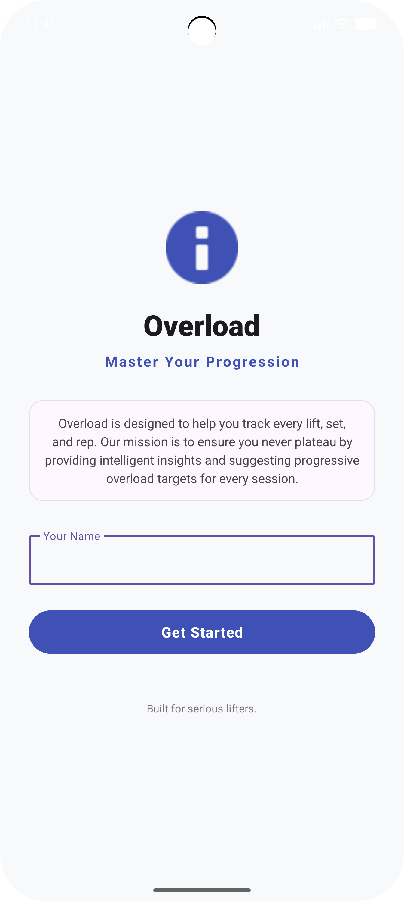
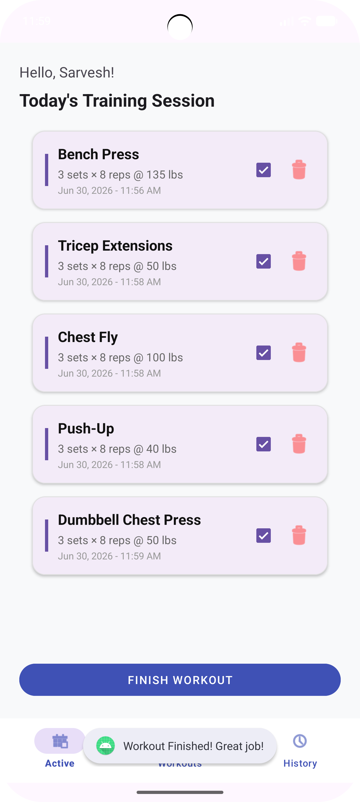

# Overload 

A native Android fitness and progression tracking application built in Java. Overload is designed to optimize gym performance by tracking individual workout sets, organizing training schedules, and utilizing local data persistence to monitor physical progression over time.

##  Key Features

* **Progressive Overload Tracking:** Structured log system to record workout sets, reps, and weight progression.
* **Component-Driven UI:** Uses a modular Fragment architecture (`TodayFragment`, `AddWorkoutFragment`) for smooth, fluid screen transitions.
* **Dynamic Content Rendering:** Implements a custom `WorkoutAdapter` to dynamically bind and display exercise data efficiently within the user interface.
* **Secure User Onboarding:** Includes a dedicated `LoginActivity` flow to manage user access sessions.

##  Architecture & Tech Stack

* **Language:** Java
* **Platform:** Android SDK / Android Studio
* **UI Layouts:** XML (Responsive ConstraintLayouts & Material Components)
* **Local Data Persistence:** SQLite database layer managed via an abstracted Data Access Object (`WorkoutDao.java` & `AppDatabase.java`) to ensure zero data loss between app sessions.
## 📱 App Demo & Walkthrough

Here is a full demonstration of the app's core workflow, features, and user interface.

### Core Workflow Demo (CRUD & State History)
This video demonstrates full CRUD operations: adding custom metrics, dynamically updating set data via modal bottom sheets, deleting workouts with a confirmation modal, and committing a finished workout to persistent history logs.

https://github.com/sarveshs-1/Overload/raw/main/Overall_Use.mp4

### UI Gallery & Component Layout
Static high-fidelity captures showcasing modern Material Design principles implemented across the application:

| Onboarding Interface | Active Session Layout |
| :---: | :---: |
|  |  |
| *Clean entry screen emphasizing brand identity with a floating-label text field.* | *High-contrast cards featuring typographic hierarchy and custom layout boundaries.* |

### Pre-Programmed Exercise Index
This video displays the pre-configured database library, populated with diverse, pre-programmed compound and accessory exercises featuring built-in instructional guides.

https://github.com/sarveshs-1/Overload/raw/main/Workout_Index.mp4
